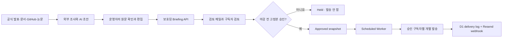

# L-PROOF-AI

공식 발표와 원문을 먼저 확인하고, 개발자에게 어떤 변화인지 사람의 판단을 더해 보내는 AI 브리핑입니다. AI가 조사와 초안을 돕지만, 검토와 승인 없이 발행되지는 않습니다.

- 서비스: [l-proof-ai.xyz](https://l-proof-ai.xyz)
- 저장소: [github.com/ipjaworld/l-proof-ai](https://github.com/ipjaworld/l-proof-ai)

## Why L-PROOF-AI

AI 소식은 빠르게 늘어나지만, 같은 발표가 여러 2차 콘텐츠로 복제되는 동안 조건과 한계가 빠지거나 전망이 사실처럼 전달되기도 합니다. L-PROOF-AI는 소식의 양보다 공식 발표, 공식 블로그, 릴리스 노트, 문서, GitHub, 논문처럼 다시 확인할 수 있는 근거를 우선합니다.

목표는 새 모델과 도구의 출시 사실을 짧게 요약하는 데서 끝나지 않습니다. 확인된 사실과 편집자의 판단을 구분하고, **그래서 이것이 실제 개발과 AI 사용 방식에 무엇을 바꾸는지**까지 전달하는 것이 이 프로젝트의 역할입니다. 이름의 `PROOF`는 많은 정보를 모았다는 뜻이 아니라, 독자가 출처와 확인 수준을 추적할 수 있어야 한다는 원칙을 담고 있습니다.

## What it does

현재 저장소에는 다음 기능이 구현되어 있습니다.

- 월요일 `Main Briefing`과 목요일 `Quick Signal`을 소개하는 공개 랜딩 페이지
- 관심 분야와 동의를 포함한 구독 신청, 중복 이메일 정규화, 수신거부
- D1 기반 구독자 상태 관리: `pending → approved | rejected | unsubscribed`
- 인증된 API를 통한 브리핑 고정본 등록과 운영자 검토 메일 발송
- 메일 링크에서 구독자를 개별 승인하거나 보류하는 검토 흐름
- 마감 전 운영자가 승인한 콘텐츠 해시만 발송 대상으로 고정하는 승인 흐름
- 승인되지 않은 원고의 자동 보류와 승인된 구독자 대상 예약 발송
- 수신자별 한 건씩 분리한 Resend 요청, idempotency key, 발송 기록
- Resend webhook을 통한 delivered, bounced, complained 상태 반영
- 허니팟, 요청 크기 제한, IP rate limit, 전체 일일 접수 상한

뉴스 탐색과 AI 초안 작성 자체는 이 애플리케이션 안의 크롤러나 모델 호출로 구현되어 있지 않습니다. 현재는 Codex를 포함한 외부 조사·작성 작업과 운영자 편집을 거친 결과물을 보호된 API로 넘기며, 이 저장소는 구독, 검토, 승인 고정본, 예약 발송과 기록을 책임집니다.

## Editorial and verification principles

편집 과정은 다음 원칙을 따릅니다.

1. **Primary source first.** 공식 발표, 릴리스 노트, 문서, 저장소와 논문을 먼저 확인합니다.
2. **Fact before interpretation.** 확인된 사실과 운영자의 해석인 `Lee's Take`를 섞지 않습니다.
3. **Human review before publication.** 날짜와 출처를 확인하고 사람이 최종 승인한 원고만 발송합니다.
4. **Evidence should remain checkable.** 각 항목에 발표일과 원문 확인 경로를 남깁니다.
5. **Do not fill a quota.** 의미 있는 변화가 적다면 억지로 항목 수를 채우지 않습니다.

브리핑 항목은 사실 요약, 개발자에게 중요한 이유, `Lee's Take`, 이번 주 할 일, 원문 URL을 기본 단위로 삼습니다. `Lee's Take`는 운영자의 판단이며, 검증되지 않은 전망을 뜻하지 않습니다.

### PROOF LEVEL

랜딩 페이지와 실제 초안에서 사용하는 검증 수준은 네 단계입니다.

| Level | 의미 |
| --- | --- |
| 전망·루머 | 아직 공식 확인되지 않은 신호 |
| 보도 기반 | 신뢰할 수 있는 보도를 근거로 확인한 내용 |
| 공식 확인 | 공식 발표나 원문에서 확인한 내용 |
| 직접 테스트 | 공식 근거 확인 후 운영자가 직접 사용해 본 내용 |

등급은 사실의 확인 수준을 나타냅니다. 편집자의 의견이나 확신 정도를 표시하는 장치가 아닙니다.

## How the pipeline works



`POST /api/briefings`는 관리자 secret을 확인한 뒤 제목, text/HTML 본문, 검토 마감과 발송 시각을 D1에 저장합니다. 저장된 콘텐츠는 SHA-256 해시와 함께 검토 메일로 전달됩니다. 운영자는 이메일 링크에서 신규 구독자를 한 명씩 승인하고, 별도의 확인 화면에서 해당 원고의 고정본을 승인합니다.

승인 시점에 계산한 해시와 발송 시점의 해시가 다르면 발송하지 않습니다. 마감까지 승인되지 않은 원고는 `held`가 되며, 승인된 원고만 예약 시각 이후 `approved` 구독자에게 한 주소씩 발송됩니다. 각 발송은 별도 delivery row와 Resend email ID를 가지므로 한 수신자의 실패가 다른 수신자에게 주소를 노출하거나 발송 상태를 섞지 않습니다.

## Human-in-the-loop

이 프로젝트는 AI를 믿는 대신, AI를 사용할 수 있는 운영 구조를 만드는 실험입니다. AI는 자료 탐색, 정리, 초안 작성 같은 반복 작업의 범위를 넓히고, 사람은 출처 확인, 의미 판단, 구독자 승인과 발행 책임을 맡습니다.

사람의 개입은 자동화를 줄이기 위한 장치가 아닙니다. 자동화가 외부 세계에 결과를 내기 전에 멈춰야 할 승인선을 명시함으로써 더 많은 작업을 안전하게 맡기기 위한 장치입니다. 그래서 승인 마감, 콘텐츠 해시, 상태 전이, 수신자별 발송 기록과 실패 상태가 제품 구조에 포함되어 있습니다.

## Automation

Cloudflare Worker의 Cron Trigger는 다음 시각에 실행됩니다. 설정은 UTC이며 괄호 안은 한국 표준시(KST)입니다.

| Cron | KST | 역할 |
| --- | --- | --- |
| `0 21 * * SUN,WED` | 월·목 06:00 | 마감된 원고 보류 처리와 발송 가능 원고 점검 |
| `50 23 * * SUN,WED` | 월·목 08:50 | 승인된 원고의 예약 웹 공개 처리 |
| `0 0 * * *` | 매일 09:00 | 마감된 원고 보류 처리와 예약 시각이 지난 승인본 발송 |

랜딩에서 안내하는 정규 발행 시각은 월요일과 목요일 09:00 KST입니다. 원고에는 `reviewDueAt`, `scheduledPublishAt`, `scheduledSendAt`을 각각 저장합니다. 권장 운영값은 웹 공개 08:50 KST, 이메일 발송 09:00 KST입니다. Cron은 마감된 미승인 원고를 `held`로 바꾸고, 승인 해시가 일치하는 원고를 먼저 웹에 공개한 뒤 공개가 완료된 원고만 발송합니다.

초안 생성과 원고 등록을 시작하는 스케줄러는 이 저장소에 없습니다. 또한 `send_failed` 발송을 자동 재시도하는 별도 queue도 아직 구현되어 있지 않습니다.

## Architecture

| 영역 | 기술과 역할 |
| --- | --- |
| Web | Next.js 16 App Router, React 19, TypeScript |
| Build/runtime adapter | 정식 Next.js 빌드와 OpenNext Cloudflare 어댑터 |
| API and scheduler | Cloudflare Worker가 HTTP API와 Cron Trigger 처리 |
| Storage | Cloudflare D1에 구독자, 원고, 발송과 webhook 이벤트 저장 |
| Schema | Drizzle ORM schema와 SQL migration |
| Email | Resend HTTP API로 검토 메일, 해지 알림, 브리핑 발송 |
| Delivery feedback | 서명 검증한 Resend webhook으로 수신·반송·스팸 신고 상태 기록 |
| UI | Tailwind CSS 4와 shadcn 기반 컴포넌트 |
| CI | GitHub Actions에서 lint, type-check, production build 실행 |

주요 데이터는 다음 네 흐름으로 나뉩니다.

- `subscribers`: 동의, 관심 분야, 승인/거절/수신거부 상태와 마지막 발송 시각
- `briefing_editions`: 한 회차의 원문, slug, 공개 메타데이터, 콘텐츠 해시, 검토·공개·발송 상태. 웹과 이메일의 단일 원본
- `briefing_deliveries`: edition과 subscriber별 개별 발송 및 실패 상태
- `email_delivery_events`: 서명 검증을 통과한 Resend webhook 원문과 이벤트 시각

별도 관리자 대시보드는 없습니다. 초기 운영에서는 검토 메일의 승인 링크와 `scripts/subscribers.mjs`를 사용합니다.

## Routes and operational surfaces

| 경로 | 용도 |
| --- | --- |
| `/` | 랜딩과 구독 신청 |
| `/articles` | 공개된 L-Proof-AI 아티클 목록 |
| `/articles/[slug]` | 개별 아티클의 canonical 원문 |
| `/privacy` | 개인정보 처리방침 |
| `/unsubscribe` | 수신거부 |
| `POST /api/subscribe` | 구독 신청 저장 |
| `POST /api/unsubscribe` | 수신거부 처리 |
| `POST /api/briefings` | 관리자 인증 후 검토할 고정본 등록 |
| `/api/briefings/approve` | 검토 링크와 최종 승인 확인 |
| `/api/subscribers/review` | 검토 메일에서 구독자 개별 승인/보류 |
| `GET /api/public/v1/articles` | HETRICH 등 외부 소비자를 위한 공개 아티클 목록 |
| `POST /api/webhooks/resend` | Resend 전송 이벤트 수신 |

구독 신청은 이메일을 소문자로 정규화하고 unique index와 upsert로 중복 row를 방지합니다. 동일 IP는 작업별 10분에 5회로 제한되며, 구독 접수는 전체 24시간당 200건으로 제한됩니다. 수신거부 알림은 24시간당 25건의 외부 이메일 상한을 가집니다. 신청 저장 API는 현재 신규 신청마다 별도 운영자 알림을 보내지 않고, 다음 원고 검토 메일에 최대 100명의 `pending` 구독자를 포함합니다.

## Local development

### Prerequisites

- Node.js 22.13 이상
- npm
- 로컬 D1 상태를 위한 Wrangler(프로젝트 dev dependency에 포함)

```bash
git clone https://github.com/ipjaworld/l-proof-ai.git
cd l-proof-ai
npm install
npm run db:migrate:local
npm run article:seed-local
npm run dev
```

개발 서버의 기본 주소는 `http://localhost:3000`입니다. `npm run dev`는 정식 Next.js 개발 서버를 사용하며, OpenNext가 로컬 D1 binding을 연결합니다.

샘플 데이터가 들어가면 다음 주소에서 목록, 상세, 공개 API를 확인할 수 있습니다.

```text
http://localhost:3000/articles
http://localhost:3000/articles/agent-approval-lines-become-the-product
http://localhost:3000/api/public/v1/articles
```

`article:seed-local`은 로컬 D1에만 샘플 아티클을 넣고 발송 시각을 먼 미래로 설정합니다. 실제 구독자에게 이메일을 보내지 않습니다. 다른 Markdown 파일을 확인하려면 파일 경로를 인자로 전달할 수 있습니다.

```bash
npm run article:seed-local -- path/to/article.md
```

Cloudflare production runtime과 같은 형태를 확인하려면 OpenNext Worker 프리뷰를 실행합니다. 이 명령은 정식 Next.js 빌드와 OpenNext 변환을 수행한 뒤 기본적으로 `http://127.0.0.1:8787`에서 Worker를 시작합니다.

```bash
npm run preview
```

프리뷰를 실행한 상태에서 별도 터미널을 열어 예약 공개 상태 전이를 검증할 수 있습니다. 검증 스크립트는 전용 테스트 row를 만들고, 공개 전 404 → scheduled trigger → 공개 후 200 → 공개 API 포함을 확인한 뒤 해당 row만 삭제합니다.

```bash
npm run article:verify-local
```

Windows에서는 OpenNext가 WSL을 권장한다는 경고를 출력할 수 있습니다. 이 저장소는 Windows 로컬 프리뷰까지 검증하지만, CI와 production 빌드는 Linux 환경을 권장합니다.

### Environment variables

`.env.example`과 `.dev.vars.example`에는 secret 값 없이 키 이름만 유지합니다. `next dev`와 Worker 프리뷰에서 필요한 Cloudflare secret은 `.dev.vars.example`을 `.dev.vars`로 복사한 뒤 입력합니다. 이 파일은 Git에서 제외됩니다. production 값은 Cloudflare variable 또는 secret으로 관리합니다.

| 변수 | 역할 |
| --- | --- |
| `RESEND_API_KEY` | Resend API 인증 |
| `EMAIL_FROM` | 검증된 발신 주소. 표시 이름은 코드에서 `L-Proof-AI`로 정규화 |
| `OPERATOR_NOTIFICATION_EMAIL` | 검토 원고와 운영 알림 수신 주소 |
| `RESEND_WEBHOOK_SECRET` | Svix 형식의 Resend webhook 서명 검증 |
| `BRIEFING_ADMIN_SECRET` | `POST /api/briefings` Bearer 인증 |
| `RATE_LIMIT_SALT` | IP 기반 rate-limit key 해싱 |
| `SITE_URL` | 이메일의 웹 원문 링크를 만드는 canonical origin |

`BRIEFING_ADMIN_SECRET`은 production에서 반드시 secret으로 설정해야 하며 브라우저 번들, 로그, 문서에 값을 기록하지 않습니다.

## Publication flow

하나의 `briefing_editions` row가 웹 원문과 이메일 고정본을 함께 소유합니다. HETRICH는 D1이나 관리자 API에 접근하지 않고 공개 API만 읽습니다.

```mermaid
flowchart LR
    A[수동 원고 등록] --> B[운영자 검토]
    B --> C[콘텐츠 해시 승인]
    C --> D[예약 웹 공개]
    D --> E[/articles/slug]
    D --> F[공개 목록 API]
    F --> G[HETRICH Insights]
    E --> H[공개 확인 뒤 이메일 발송]
```

공개 API는 `publication_status = published`이고 `published_at`이 현재 시각 이전인 row만 반환합니다. 응답에는 제목, 요약, 회차, 발행일, Proof Level, 태그, 이미지와 canonical URL만 포함되며 초안 본문, 승인 토큰, 구독자 및 발송 정보는 포함하지 않습니다.

```http
GET /api/public/v1/articles?limit=20&cursor=...
```

목록 응답에는 `Cache-Control`, `ETag`과 다음 페이지용 `nextCursor`가 포함됩니다. 공개 데이터이므로 API key는 사용하지 않습니다. 상세 원문은 L-Proof-AI에서만 제공하며 HETRICH는 목록 카드가 canonical URL을 가리키도록 구현합니다.

### Checks

```bash
npm run lint
npm run typecheck
npm run build
```

현재 별도의 unit/integration test suite는 없습니다. CI도 위 세 검증을 실행합니다. production 이메일을 다루는 변경은 이 검증과 함께 수신자 수, 승인 상태, 발송 기록을 운영자가 확인해야 합니다.

## Subscriber operations

20명 이하의 초기 운영에서는 다음 스크립트로 production D1을 조회하고 한 명씩 승인합니다. 로컬 DB를 대상으로 하려면 명령 끝에 `--local`을 붙입니다.

```bash
npm run subscribers -- status
npm run subscribers -- pending
npm run subscribers -- approved
npm run subscribers -- rejected
npm run subscribers -- approve person@example.com
npm run subscribers -- reject person@example.com
npm run subscribers -- recipients
```

발송 대상은 `status = 'approved'`이고 `unsubscribed_at IS NULL`인 row로 제한됩니다. `email_verified_at`은 향후 double opt-in을 위한 필드이며 현재 발송 조건에는 포함되지 않습니다.

상세 운영 규칙은 [`docs/BRIEFING_DELIVERY_SAFETY.md`](docs/BRIEFING_DELIVERY_SAFETY.md), [`docs/HANDOFF_SENDING_AGENT.md`](docs/HANDOFF_SENDING_AGENT.md), [`docs/QA_CHECKLIST.md`](docs/QA_CHECKLIST.md)에서 확인할 수 있습니다. 카피와 편집 방향의 기준은 [`docs/POSITIONING.md`](docs/POSITIONING.md), 시각 시스템의 기준은 [`docs/DESIGN_PRINCIPLES.md`](docs/DESIGN_PRINCIPLES.md)입니다.

## Deployment

production 도메인은 [l-proof-ai.xyz](https://l-proof-ai.xyz)이며 Cloudflare custom domain으로 연결됩니다. 저장소의 GitHub Actions는 `main` push와 pull request에서 품질 검증만 수행합니다. 실제 배포는 다음 스크립트로 정식 Next.js 빌드, OpenNext Worker 변환, remote D1 migration, Cloudflare deploy를 순서대로 실행합니다.

```bash
npm run deploy:cloudflare:full
```

현재 저장소에는 `main` push만으로 production을 자동 배포하는 GitHub Actions workflow는 없습니다.

## Project status

L-PROOF-AI는 공개 랜딩과 production D1 구독 흐름을 운영하고, human-reviewed 예약 발송 구조를 구현 중인 **개인 운영형 alpha**에 가깝습니다. 작은 범위라도 뉴스 수집에서 검수, 승인, 이메일 발송과 운영 기록까지 실제 제품 흐름으로 연결하고, 그 과정에서 드러난 문제를 다시 설계에 반영하는 단계입니다.

현재 경계를 과장하지 않기 위해 남아 있는 항목도 함께 기록합니다.

- 신규 신청은 수동 승인하며 double opt-in은 아직 적용하지 않았습니다.
- 관리자 대시보드와 발송 실패 자동 재시도 queue가 없습니다.
- 자동화된 테스트 suite가 없고 lint, type-check, build 및 운영자 QA에 의존합니다.
- QA 문서 기준으로 production 공개와 D1 E2E는 확인했지만, Resend 실제 성공과 운영자 inbox 도착 항목은 아직 미완료로 남아 있습니다.
- 저장소의 샘플 브리핑에는 실제 원문 검증 과정을 보여주는 초안이 있으나, 지속적인 뉴스 수집 서비스는 애플리케이션에 내장되어 있지 않습니다.

## Part of HETRICH

L-PROOF-AI는 독립적으로 실행되는 제품이면서, 개인이 AI를 이용해 실제 문제를 해결하는 작은 제품을 만들고 운영하는 상위 제품군 **HETRICH**의 일부입니다.

```text
HETRICH
├── L-PROOF-AI
├── HETRICH AI Secretary
└── How Much Calories Left
```

HETRICH는 AI 데모보다 사람이 생활과 업무에서 계속 사용할 수 있는 제품에 관심을 둡니다. 모델 자체의 성능뿐 아니라 Context, Memory, Automation, Human approval, External tools, Reliable execution이 함께 어떤 경험을 만드는지 실험합니다.

그 안에서 L-PROOF-AI는 **정보 수집 → 검증 → 사람의 승인 → 자동 발행**이라는 흐름을 다룹니다. AI가 초안을 만들고, 사람이 기준과 판단을 제공하며, 자동화가 반복 실행을 맡는 구조를 실제 운영 가능한 크기로 구현하는 프로젝트입니다.
