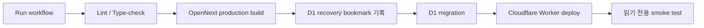

# Production CD 도입 보고서

작성일: 2026-09-24

## 결론

L-Proof-AI production 배포를 GitHub Actions의 **수동 승인형 Continuous Delivery**로 전환했다. `main`에 push하는 것만으로 production이 바뀌지는 않는다. 운영자가 GitHub Actions에서 `Deploy production`을 직접 실행해야 배포가 시작된다.

## 변경 사항

| 구분 | 이전 | 변경 후 |
| --- | --- | --- |
| Production 배포 | 로컬 명령으로만 수행 | GitHub Actions에서 수동 실행 가능 |
| 배포 시작 조건 | 작업자의 로컬 환경과 자격 증명 | `workflow_dispatch`와 `production` environment |
| 중복 배포 | 별도 방지 장치 없음 | `production-deploy` concurrency로 직렬화 |
| CI build | 일반 Next.js build | 실제 배포물과 같은 OpenNext Cloudflare build |
| D1 변경 | 배포 스크립트에서 즉시 migration | recovery bookmark를 먼저 로그에 남기고 migration |
| 배포 후 확인 | 수동 브라우저 확인 | 홈, 아티클 목록, 공개 API를 읽기 전용으로 자동 확인 |

추가된 파일은 `.github/workflows/deploy-production.yml`, `scripts/smoke-production.mjs`이며 기존 CI와 npm 배포 스크립트도 production 구성에 맞게 정리했다.

## 안전 경계

- 이 workflow는 이메일 발송 API와 scheduled endpoint를 호출하지 않는다.
- smoke test는 공개 페이지와 공개 API에 `GET` 요청만 보낸다.
- D1에는 저장소에 포함된 versioned migration만 적용한다.
- `--keep-vars`를 사용해 Cloudflare에 이미 저장된 secret을 덮어쓰지 않는다.
- 동시 production 배포를 허용하지 않으며, 진행 중인 배포를 새 실행이 취소하지 않는다.
- 배포 전 D1 Time Travel recovery 정보가 Actions 로그에 기록된다.

## 운영자가 최초 1회 해야 할 설정

1. GitHub 저장소에서 `Settings` → `Environments` → `New environment`를 열고 이름이 정확히 `production`인 environment를 만든다.
2. `production` environment의 `Environment secrets`에 아래 두 값을 등록한다.
   - `CLOUDFLARE_API_TOKEN`: Cloudflare의 `Edit Cloudflare Workers` 템플릿으로 만들고 L-Proof-AI 계정으로 범위를 제한한다. remote migration을 위해 `Account > D1 > Edit`, 설정된 custom domain 유지를 위해 `Zone > Workers Routes > Edit` 권한도 포함한다.
   - `CLOUDFLARE_ACCOUNT_ID`: `wrangler.jsonc`의 `account_id` 값
3. 계정 플랜에서 지원한다면 `Required reviewers`에 본인을 지정한다. 혼자 운영하는 경우 자기 승인 차단 옵션은 켜지 않는다.
4. 이 변경이 `main`에 반영되고 CI가 통과한 뒤 `Actions` → `Deploy production` → `Run workflow` → `main`을 선택해 첫 배포를 실행한다.
5. 실행 로그에서 `Record D1 recovery bookmark`, `Apply production D1 migrations`, `Deploy Cloudflare Worker`, `Run read-only production smoke test`가 모두 성공했는지 확인한다.

API token은 저장소 파일이나 Cloudflare Worker 변수에 넣지 않고 GitHub `production` environment secret으로만 보관한다.

## 이후의 정규 배포 절차

1. 변경을 `main`에 push하고 `CI` 성공을 확인한다.
2. `Deploy production` workflow를 수동 실행한다.
3. deployment environment 승인이 설정되어 있다면 승인한다.
4. workflow 완료 후 `https://l-proof-ai.xyz`와 `/articles`를 최종 육안 확인한다.

일반적인 `main` push는 CI만 수행하므로 원고 작성이나 코드 push가 곧바로 production 공개 또는 이메일 발송을 만들지 않는다.

## 장애와 복구

- Worker 배포 문제는 Cloudflare Workers의 배포 버전에서 직전 정상 버전으로 되돌린다.
- D1 문제는 해당 Actions 실행의 `Record D1 recovery bookmark` 로그를 기준으로 Time Travel 복구를 검토한다.
- migration 단계에서 실패하면 배포 단계로 진행하지 않는다. Wrangler의 D1 migration은 실패한 migration을 rollback한다.
- smoke test가 실패하면 배포 자체는 이미 끝난 상태일 수 있으므로 로그와 production 화면을 확인한 뒤 Worker rollback 여부를 결정한다.

## 현재 의도적으로 하지 않은 것

- `main` push 즉시 자동 production 배포
- 이메일 발송 또는 Cron 강제 실행
- 아티클 데이터 자동 변경
- 실패 시 D1 자동 복원

자동 복원은 정상 데이터까지 되돌릴 위험이 있어 운영자가 recovery bookmark와 장애 범위를 확인한 뒤 결정하도록 남겨두었다.

## 참고 문서

- [Cloudflare Workers GitHub Actions](https://developers.cloudflare.com/workers/ci-cd/external-cicd/github-actions/)
- [Cloudflare D1 Wrangler commands](https://developers.cloudflare.com/d1/wrangler-commands/)
- [GitHub deployment environments](https://docs.github.com/en/actions/how-tos/deploy/configure-and-manage-deployments/control-deployments)
