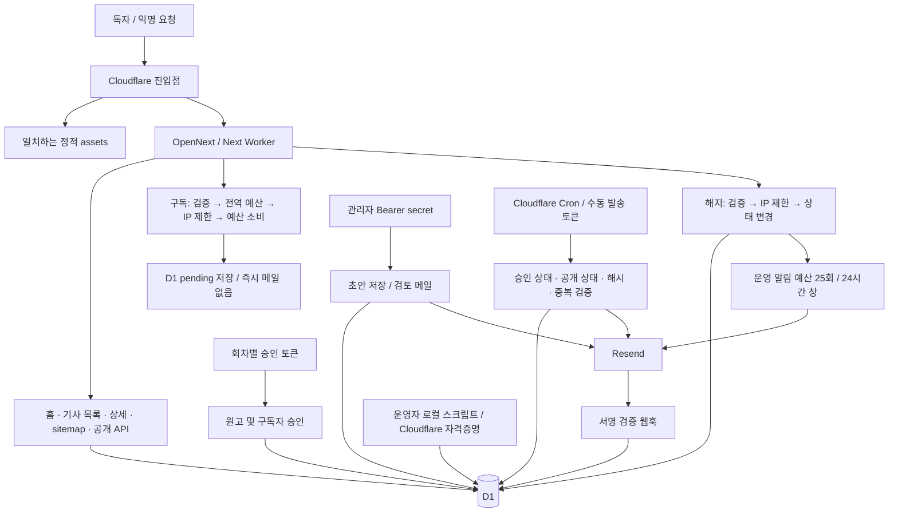

# L-Proof AI 비용 방어·운영 안정성 감사 보고서

작성일: 2026-09-29 (KST)  
기준: HEAD `1f7588fd9a968cfd2a932d6e891f86b995c81324`와 현재 작업 트리  
요청 출처: [공유 대화의 마지막 Codex 전달 메모](https://chatgpt.com/share/6abb9755-d034-83ee-b414-0fcdc62f4442)

## 판단 요약

**지금은 Cloudflare/D1을 이전하기보다 공개 읽기의 동적 실행을 줄이고, 모든 이메일 경로에 공통 예산 차단을 넣는 것이 우선이다.** 현재 코드에서 익명 방문자가 LLM API를 실행하는 경로는 발견하지 못했다. 구독 신청에도 상당한 방어가 이미 있다. 그러나 전체 서비스 비용에 확정적인 월 상한이 있는 구조는 아니다.

- 독자의 홈·기사 열람 → Worker와 D1. LLM·Resend 호출은 없다.
- 구독 신청 → 검증·접수 예산·IP 제한·D1 저장. 즉시 확인 메일이나 운영자 메일을 보내지 않는다.
- 구독 해지 → D1 상태 변경 후 조건부 운영자 메일. 익명 요청과 유료 외부 API가 연결된 예외이며, 24시간 창당 25회 시도 예산이 있다.
- 검토용 메일·뉴스레터 → 관리자 비밀값/승인 토큰 또는 Cron을 통해 실행한다. 중복 발송 방어는 있으나 전체 일일·월간 발송 예산은 없다.
- 대량 익명 트래픽에서 직접 누적되는 비용은 Worker 요청·CPU·로그와 D1이다. 현재 확인한 구조만으로 LLM 비용 폭주를 걱정할 이유는 없다.
- 비용과 별개로 이메일 주소만 알면 해지할 수 있는 문제와 승인 화면의 HTML 삽입 지점은 먼저 고쳐야 한다.

이번 단계는 전달 메모의 “리팩터링을 시작하기 전에 먼저 감사 결과와 수정 제안을 보여 달라”는 범위로 수행했다. 애플리케이션 코드·DB·배포·발송 설정은 변경하지 않았다.

## 감사 범위와 증거 수준

읽은 범위는 `app`의 전체 페이지·API, 관련 `components`, `lib`, `db`, SQL 마이그레이션, `worker.ts`, Wrangler/OpenNext/Next 설정, 운영 스크립트와 GitHub Actions다. 저장소에 존재하는 미커밋 발송 관련 변경도 현재 상태로 포함했다. 시작 시부터 수정되어 있던 `lib/briefing-workflow.ts`, `docs/BRIEFING_DELIVERY_SAFETY.md`, `package.json` 및 신규 초안·예약 스크립트는 건드리지 않았다.

증거는 다음처럼 구분한다.

| 수준 | 이번에 확인한 것 | 한계 |
|---|---|---|
| 코드 확인 | 요청 흐름, SQL, 인증, 예산, 외부 호출, Cron | 현재 배포본이 작업 트리와 완전히 동일하다고 보장하지 않음 |
| 운영 읽기 확인 | 공개 GET 4회로 홈·아카이브·공개 API 헤더 | 전체 POP의 캐시 적중률이나 청구량 측정은 아님 |
| 로컬 검증 | 마이그레이션을 메모리 SQLite에 적용, 실행 계획과 예산 SQL 검증 | 원격 D1의 실제 데이터·통계·동시성 부하 테스트는 아님 |
| 공식 문서 확인 | Workers/D1/Resend 가격과 한도 | 실제 계정 플랜·공유 사용량·초과 과금 설정은 미확인 |

운영 DB의 개인정보나 API 키 값은 열람하지 않았다. 대량 요청·메일 발송·원격 쓰기 테스트도 수행하지 않았다. 저장소 밖의 Codex 자동화, AI 제공자 계정, Cloudflare WAF/캐시 규칙, 실제 구독자 수와 청구서는 이번 감사 범위에서 확인되지 않았다. 대화의 “42명”은 계산 예시로만 사용한다.

## A. 현재 아키텍처

**그림의 AI 생성 노드가 없는 것은 누락이 아니다.** 검사한 런타임·운영 스크립트에 LLM 호출이나 뉴스 수집 API 호출이 없다. 서버 Cron은 원고를 생성하지 않고 기존 원고의 보류·공개·발송만 처리한다. `worker.ts:9`, `lib/briefing-workflow.ts:469`가 진입점이다.

Wrangler Cron은 KST 월·목 06:00, 월·목 08:50, 매일 09:00이다. 각 실행마다 동일하게 보류 → 공개 → 발송 기한 검사를 수행한다. 따라서 공개 시각을 등록한다고 정확히 그 분에 작업이 실행되는 것은 아니며, 다음 Cron까지 기다릴 수 있다.

`scripts/schedule-third-edition.mjs`, `send-second-edition-now.mjs`, `import-approved-briefing.mjs`는 원격 D1에 직접 승인/공개 상태를 기록하는 운영 경로다. 웹 승인 화면을 거치지 않지만 공개 endpoint가 아니라 Cloudflare 자격증명이 필요한 로컬 경로다. 향후 방어를 웹 API에만 붙이면 이 경로가 빠지므로 실제 발송 함수에서 공통 제한을 강제해야 한다.

### 전체 요청 경로 분류

W=Worker 실행, R/Wr=D1 읽기/쓰기, E=이메일 외부 API. SQL 수는 주요 애플리케이션 문장 수이며 과금 rows 수와 다르다. 인덱스 갱신도 D1 쓰기량에 영향을 준다.

| 경로/동작 | 접근 조건 | 비용 | 반복 호출 가능성과 현재 제한 |
|---|---|---|---|
| JS/CSS/폰트/이미지 등 assets | 익명 | 정적 asset 직접 제공 시 거의 없음 | 무제한 반복 가능; Worker를 경유하는 구성과 구별 필요 |
| `/privacy`, `/unsubscribe`, `/robots.txt`, 기본 오류 페이지 | 익명 | 정적 렌더 결과; 어댑터 제공 경로에 따라 W 가능 | 현재 빌드 manifest에서 정적 route 확인. D1/메일 없음 |
| `GET /` | 익명 | W + R(목록 1회) | `force-dynamic`, 최신 기사 3개; 요청 빈도 제한 없음 |
| `GET /articles` | 익명 | W + R(목록 1회) | `force-dynamic`, 최대 50개 |
| `GET /articles/[slug]` | 익명 | W + R(보통 상세 1 + 인접 기사 2) | 없는 slug도 조회 1회. React cache는 한 렌더 안의 중복 제거 |
| `GET /sitemap.xml` | 익명 | W + R(목록 1회) | `force-dynamic`, 현재 50개까지만 나열 |
| `GET /api/public/v1/articles` | 익명 | W + R(목록 1회) | limit 1~50, cursor 형식·길이 제한; 캐시 헤더 있음 |
| 위 API의 `OPTIONS` | 익명 | W | DB·외부 호출 없음 |
| `POST /api/subscribe` | 익명 | W + R/Wr | IP 5회/10분, 전역 200회/24시간 창, 정상 성공 경로 SQL 약 4회 및 5% 확률 정리 |
| `POST /api/unsubscribe` | 익명 | W + R/Wr + 조건부 E | IP 5회/10분, 실제 상태 변경 때만 알림 예산 소비. 예산 초과 후에도 DB 작업 발생 |
| `POST /api/briefings` | Bearer 관리자 비밀값 | W + R/Wr + E(검토 메일 1통) | 인증 전 DB 없음. 인증된 호출의 전체 예산/횟수 제한 없음 |
| `GET /api/briefings/approve` | 값이 있는 edition/token만 요구 | W | 확인 폼 표시, 토큰 검증/DB/발송 없음 |
| `POST /api/briefings/approve` | 회차 토큰 + 기한·해시·상태 검증 | W + R/Wr | 실패 요청도 회차 조회 가능; 직접 발송하지 않음 |
| `GET /api/subscribers/review` | 값이 있는 파라미터만 요구 | W | 확인 폼 표시, DB/발송 없음 |
| `POST /api/subscribers/review` | 회차 토큰 + 검토 기한 | W + R/Wr | pending 구독자만 승인. 로그인 세션 대신 토큰 소지가 권한 |
| `POST /api/briefings/send` | 회차 토큰 + approved + 기한 + 해시 + 공개 상태 | W + R/Wr + E(N통) | 잘못된 토큰은 발송 불가. 검증 전 회차 조회는 가능 |
| `POST /api/webhooks/resend` | HMAC 서명 + 5분 시간 검증 | W + 유효 이벤트에 R/Wr | 위조 요청은 DB 전 차단. 유효한 재전송은 일부 UPDATE를 반복 |
| Cron | Cloudflare scheduled 이벤트 | W + R/Wr + 기한 도래 때 E | 외부 HTTP에서 직접 호출하는 앱 route 없음; 회차/수신자 batch 상한 없음 |
| 로컬 관리·발행 스크립트 | 운영자 Cloudflare 자격증명 | D1 R/Wr, 선택적 발송 API | 공개 트래픽과 무관. 앱 인증/예산을 우회하는 직접 DB 경로 존재 |
| GitHub CI/수동 배포 | push/PR 또는 workflow_dispatch 권한 | Actions 빌드 시간, 배포·마이그레이션 | 웹사이트 조회로 빌드가 시작되지 않음. 실제 계정 과금은 미확인 |

`app/chatgpt-auth.ts`의 인증 유틸리티는 검사한 경로에서 호출되지 않는다. 이 파일의 존재를 관리자 보호의 근거로 삼지 않았다. 현재 관리 기능의 실제 보호는 Bearer secret과 회차 토큰이다.

## B. 비용 발생 지점

### 공개 읽기는 아직 정적/CDN 중심이 아니다

`app/page.tsx:17`, `app/articles/page.tsx:6`, `app/articles/[slug]/page.tsx:8`, `app/sitemap.ts:4`는 `force-dynamic`이다. D1 직접 조회를 감싸는 공유 캐시도 확인되지 않는다. OpenNext 설정은 기본 `defineCloudflareConfig()`이며 별도의 캐시 저장소 binding이 Wrangler에 없다.

운영 GET 관찰:

| 요청 | 응답 | Cache-Control | 부가 관찰 |
|---|---|---|---|
| `/` | 200 | `private, no-cache, no-store, max-age=0, must-revalidate` | Age/CF-Cache-Status 없음 |
| `/articles` | 200 | 동일 | Age/CF-Cache-Status 없음 |
| 공개 API `?limit=1`, 2회 | 200, 200 | `public, max-age=60, s-maxage=300, stale-while-revalidate=3600` | 같은 weak ETag, Age/CF-Cache-Status 없음 |

API의 헤더는 캐시 허용 의도이지 CDN 적중 증명이 아니다. Age/CF-Cache-Status 부재만으로 미적중을 확정할 수도 없다. 다만 `app/api/public/v1/articles/route.ts:34`가 D1 조회 후 ETag를 계산하고 304를 판단하므로, handler까지 도달한 조건부 요청은 DB 조회를 절약하지 않는다.

설치된 Next 문서의 `cdn-caching.md`와 `caching-without-cache-components.md`를 확인했다. HTML/RSC를 구분하지 않는 단순한 “모든 GET 캐시” 규칙은 제안하지 않는다. React `cache()` 역시 방문자 간 영속 캐시가 아니다.

### 서비스별 과금과 의미

2026-09-29 공식 문서 기준이다. 아래 포함량은 계정의 다른 서비스 사용과 공유될 수 있으므로 프로젝트 전용 무료 잔여량으로 보면 안 된다.

| 서비스 | 돈이 늘어나는 행동 | 확인한 요금/한도 및 의미 |
|---|---|---|
| Workers Standard | 동적 요청 수·CPU 시간 | 월 최소 $5, 요청 1,000만 및 CPU 3,000만 ms 포함. 초과 요청 $0.30/100만, CPU $0.02/100만 ms |
| Workers Logs | 수집되는 로그 이벤트 | Paid 월 2,000만 이벤트 포함, 초과 $0.60/100만. 현재 observability 활성화, 저장소에 sampling 값 없음 |
| D1 | 스캔한 rows, 쓴 rows와 인덱스, 저장 용량 | Paid 월 읽기 250억/쓰기 5,000만 포함. 초과 읽기 $0.001/100만, 쓰기 $1/100만; 저장 5GB 이후 $0.75/GB-month |
| Resend | 검토 메일·개별 브리핑·해지 알림 | Free 월 3,000통·일 100통. Pro 월 $20/50,000통, 추가 $0.90/1,000통. 유료 초과 과금은 설정 확인 필요 |
| LLM | 현재 저장소에서 해당 호출 없음 | 현재 공개 요청당 모델 호출 0. 외부 자동화 계정의 소비까지 0이라고 단정하지 않음 |
| 정적 assets | 직접 asset 제공 | 무료·무제한 요청. Worker 캐시 기능을 거친 요청까지 모두 무료라는 뜻은 아님 |

출처: [Workers 및 Logs 가격](https://developers.cloudflare.com/workers/platform/pricing/), [D1 가격](https://developers.cloudflare.com/d1/platform/pricing/), [Resend 가격](https://resend.com/pricing), [Static Assets 과금](https://developers.cloudflare.com/workers/static-assets/billing-and-limitations/).

현재 서비스 수준에서 D1 읽기보다 Worker CPU·요청 및 로그가 먼저 의미 있는 지출이 될 가능성이 높다. 다만 이것은 소량 기사와 인덱스 기반 조회라는 전제의 구조적 판단이며, 실제 청구 순위는 CPU와 D1 `rows_read`/`rows_written` 실측이 필요하다. 대량 쓰기 공격에서는 D1 쓰기도 별도로 중요하다.

예시: 다른 사용량이 없고 월 1억 동적 요청, 평균 CPU 7ms라 가정하면 Worker 기본료·요청·CPU는 $45.40이다. 동일 요청에 평균 CPU가 50ms면 $131.40이다. 로그·D1·메일은 제외한 가정 계산이며 현재 청구 예측이 아니다. 캐시는 CPU와 DB를 줄일 수 있지만 사용하는 캐시 제품에 따라 요청 자체는 계속 과금될 수 있다.

Resend 계산은 대화 내용을 수정해야 한다. 42명 × 주 2회 × 4.3주 ≈ 월 361통은 예시로 타당하다. 그러나 300명 × 8.6 ≈ 2,580통이라고 무료 플랜으로 한 번에 발송할 수는 없다. **일 100통 제한**이 먼저 걸리고, 검토·운영 알림도 같은 할당량을 쓴다. 제공자 일 한도는 UTC 달력 날짜 기준이다. [Resend Usage Limits](https://resend.com/docs/api-reference/rate-limit)

## C. 공격 가능한 지점

### 1. 공개 페이지·API 반복 조회

인증 없이 CPU와 D1을 사용할 수 있다. `/articles/[slug]`에 무작위 slug를 주거나 공개 API의 query를 바꾸면 캐시를 붙여도 miss를 만들 수 있다. 목록의 limit 50은 반환 개수 제한일 뿐 스캔 rows 50을 보장하지 않는다.

메모리 SQLite 실행 계획에서 기사 목록은 `idx_briefing_editions_publication_schedule(publication_status, scheduled_publish_at)`를 사용하지만 `ORDER BY published_at, id`에 임시 B-tree를 사용했다. 기사 수가 작으면 영향이 작으나 트래픽과 누적 기사 수가 함께 늘면 불필요한 스캔·정렬이 확대된다. 목록 API가 응답에 쓰지 않는 `content_text`까지 가져오는 점도 CPU·전송량 낭비다. 행 크기를 줄이는 것이 D1 rows 과금을 직접 줄인다는 뜻은 아니다.

### 2. 구독 신청 예산 소진 및 D1 기반 제한의 잔여 비용

`app/api/subscribe/route.ts:31`과 `db/subscribers.ts:40`의 200회 상한은 실제로 조건부 UPSERT로 강제된다. 사전 `hasBudget` 체크만 믿는 구조가 아니라 최종 소비도 조건부이므로 경쟁 요청이 단순히 상한을 뚫는다고 판단하지 않았다. 로컬 250회 호출에서 정확히 200회 허용됐다.

다만 전역 예산은 신규 이메일 수가 아닌 **유효 요청 수**다. 이메일별 cooldown이 없어 이미 등록된 이메일을 여러 IP에서 반복해도 예산을 소비한다. 현재 창에서 예산이 남아 있다면 이론상 40개 IP × 5회로 200회를 소진할 수 있다. 초과 후에는 저장하지 않고 성공 메시지를 반환하므로 실제 독자가 신청됐다고 오해한다.

상한 이후에도 유효 요청마다 Worker와 `hasBudget`의 DB 조회가 남는다. IP limiter도 D1에서 실행되므로 차단 자체가 무료가 아니다. 시간창은 첫 소비/갱신 기준이며 KST 자정 일일 한도나 엄밀한 sliding-window 한도가 아니다.

### 3. 익명 해지 및 운영자 알림

`db/subscribers.ts:146`은 이메일 일치만으로 상태를 `unsubscribed`로 바꾼다. 주소 소유 증명이나 구독자별 서명 토큰이 없다. 같은 주소 재해지는 상태 변경이 없어 메일이 나오지 않지만, 재구독(pending 복귀)과 해지를 교대로 하면 다시 알림 경로에 들어갈 수 있다.

알림은 고정 운영자 주소로만 가며 임의 수신자 대량 발송 API는 아니다. `global:operator-notification`이 24시간 창당 최대 25회 시도를 제한하고 Resend idempotency도 있다. 따라서 무제한 메일 폭탄이라고 평가하지 않는다. 더 직접적인 위험은 제3자의 구독 해지와 정상 접수 방해다.

해지에는 전역 DB 작업 상한이 없고, 분산 IP로 `request_limits` 행이 늘 수 있다. 오래된 limiter 행 정리는 구독 성공 경로에서만 5% 확률로 실행된다. 해지 트래픽만 많거나 구독 예산이 소진되면 정리가 지연된다. `updated_at` 정리 쿼리는 로컬 계획에서 테이블 스캔이었다.

### 4. 관리 endpoint와 입력 크기

관리 원고 등록은 인증을 DB보다 먼저 검사하고, 비밀값이 없으면 실패한다. 반면 승인·구독자 검토·수동 발송은 토큰을 검사하기 위해 먼저 회차를 조회한다. 잘못된 토큰을 반복해도 메일은 안 보내지만 Worker/D1 비용은 생긴다. 이 경로에는 IP 제한이나 공통 body reader가 없다.

구독/해지는 8KiB 검사가 있지만 실제 body 전체를 `request.text()`로 읽은 뒤 검증한다. 선언 길이가 없으면 메모리를 먼저 사용한다. 원고 등록의 512,000 bytes 제한은 Content-Length만 검사한다. 웹훅과 승인 formData, 수동 발송 JSON에는 앱 수준 실측 크기 제한이 없다. 플랫폼 최대 요청 크기가 있어도 작은 서비스에 적절한 제한을 대신하지 않는다.

### 5. 승인 확인 화면의 HTML 삽입

`app/api/briefings/approve/route.ts:19`에서 `<strong>${edition}</strong>`에 URL 값을 escape 없이 삽입한다. hidden input만 정리해도 본문은 보호되지 않는다. 조작한 링크로 동작할 수 있는 반사형 XSS 지점이다. 코드상 재현 가능한 삽입 지점으로 판단했으며 운영 브라우저에서 공격 payload는 실행하지 않았다. 실제 실행 가능성에는 운영 CSP 등도 영향을 주며 현재 응답의 CSP는 확인하지 않았다.

이 문제가 단독으로 유효 승인 토큰을 만들어 내지는 않는다. 그러나 관리자용 화면에서 같은 origin 스크립트 실행을 허용하는 것은 승인 흐름의 신뢰를 훼손하므로 비용 기능보다 먼저 작은 수정으로 제거할 가치가 있다.

### 6. 인증된 메일 발송과 재처리

`lib/briefing-workflow.ts:307`의 상태 claim, 회차·구독자 UNIQUE, Resend idempotency key는 이미 존재한다. 토큰 없는 방문자가 발송 버튼을 반복해 같은 뉴스레터를 무제한 보내는 구조가 아니다.

다만 `sendWithResend`와 별도 `notifyOperator`를 모두 포괄하는 일일·월간 예산이 없고, 한 번에 읽는 대상 회차/구독자 수도 제한하지 않는다. 관리자 실수로 다수 회차를 승인하거나 승인 대상이 늘면 그만큼 메일이 발생한다. idempotency는 같은 작업 중복 방어이며 서로 다른 작업의 총지출 제한이 아니다.

현재 5분 분산은 Resend `scheduled_at` 값의 분산이다. API 요청 자체를 5분에 걸쳐 제한하는 구조는 아니며, 이미 예정 시간이 지났다면 대부분 즉시 요청한다. 제공자 429/일 한도에 대한 구분된 보류·제한 재시도가 없다. 제공자 요청 실패 시 `failed` 행이 남고, 기존 행은 다음 INSERT의 충돌로 건너뛰므로 상태만 approved로 되돌리는 방식으로 안전하게 복구되지 않는다. 프로세스 중단 시 `sending`/`pending`에 남을 가능성도 있다.

### 7. 웹훅과 로그

서명 없는 웹훅은 DB 전에 차단된다. event ID UNIQUE는 중복 이벤트 INSERT를 막지만 같은 batch의 subscriber/delivery UPDATE까지 생략하지 않는다. 서명 유효 시간 안의 재전송도 이 비용을 낼 수 있으나, 공격자는 먼저 유효 서명 이벤트를 확보해야 한다. 익명인이 아무 JSON으로 DB를 쓰는 경로가 아니다.

`notification_email_id` 대상 subscriber UPDATE는 인덱스가 없어 로컬 계획에서 전체 스캔이었다. 정상 이벤트 수에서도 누적 구독자 수에 비례하는 읽기가 생길 수 있다. observability와 오류 로그도 트래픽에 연동될 수 있으므로 실제 sampling/수집량 확인이 필요하다.

## D. 위험도

High는 지금 수정할 운영·보안 결함, Medium은 노출/규모에 따라 비용·장애로 확대되는 결함, Low는 현재 방어와 규모에서 낮은 위험이다. 모든 High를 “당장 큰 청구서 발생”으로 해석하지 않는다.

| 항목 | 등급 | 판단 |
|---|---|---|
| 이메일만으로 타인 해지 | High | 실제 구독자 상태 변경 가능. 비용보다 서비스 신뢰·가용성 위험 |
| 승인 화면 HTML 삽입 | High | 코드상 출력 인코딩 누락; 악성 링크 방문 조건, 운영 CSP 미확인 |
| 공개 읽기의 매 요청 Worker/D1 | Medium | 정상 확산·분산 요청 모두 비용 증가. 현재 DB가 작다는 점은 완화 요소 |
| 접수 예산 소진·조용한 접수 누락 | Medium | 돈의 상한은 있으나 공격자가 정상 접수를 막을 수 있음 |
| 전체 이메일 예산 부재 | Medium | 무인 외부 악용은 제한적이나 관리자 실수·성장·자동화에 상한 없음 |
| 발송 실패·중단의 복구 부재 | Medium | 일 한도·429·프로세스 중단 시 일부 구독자 미발송 |
| body 크기·limiter 행 정리·관리 API 반복 조회 | Medium | 요청·CPU·DB 비용과 자원 고갈 경로 |
| 기사 정렬/웹훅 인덱스 | Low | 현재 소규모면 영향 작음. 데이터 성장 시 상승 |
| 익명 LLM 비용 유발 | Low | 현재 조사 범위에서는 호출 경로 자체 없음 |
| 토큰 없는 뉴스레터 발송·위조 웹훅 DB 쓰기 | Low | 토큰·상태·해시·서명 검증이 작동하도록 구현됨 |
| D1 또는 온프레미스 이전의 시급성 | Low | 이전을 정당화할 실사용 비용 증거 없음 |

## E. 반드시 수정할 것

아래는 다음 구현 단계의 제안이며 이번 감사에서 적용하지 않았다. 작은 변경으로 시작하고 기존 1인 1메일, 승인된 고정본, 웹 공개 후 발송 규칙은 유지한다.

| 순서 | 제안 | 완료 판정 |
|---|---|---|
| 1 | 승인 화면 edition/token 형식·길이 검증, 모든 HTML 출력 escape. 토큰 페이지 no-store 유지, Referrer-Policy 점검 | 특수문자 입력이 텍스트로만 렌더되고 스크립트 실행 불가 |
| 2 | 개별 메일에 구독자와 작업에 묶인 서명 해지 링크 제공. 이메일만으로 타인 상태 변경하는 경로 제거/대체 | 주소만 아는 제3자는 해지 불가, 정상 독자는 로그인 없이 해지 가능. 기존 독자의 해지 수단 유지 |
| 3 | 구독에 Turnstile 등 검증 추가, 동일 normalized email cooldown 및 전역 예산 소진 상태의 정직한 응답 | 무효 검증은 DB 전 차단, 동일 주소 반복으로 접수 예산 고갈을 줄임. 저장하지 않았으면 접수 완료라 표시하지 않음 |
| 4 | 현재 플랜의 edge 제한/WAF 적용 가능 범위 확인 후 가장 노출된 경로에 적용 | 차단 요청의 Worker/D1 도달 감소를 측정. 다른 hostname/직접 Worker URL도 적용 범위 확인 |
| 5 | 두 메일 함수에 공통 일일·월간·job 발송 상한과 kill switch 적용 | 검토/브리핑/알림/수동 발송이 전부 동일 gate를 거침. 초과 시 외부 API 호출 0 |
| 6 | 홈·기사·sitemap·공개 API에 검증 가능한 캐시 경로 구축 | 반복 읽기에서 D1 호출 감소, 승인 전 원고 비공개, 공개 후 갱신, HTML/RSC 분리, 404/query 우회 검증 |
| 7 | 공개 body를 스트리밍으로 제한하고 관리 form/JSON·웹훅에도 적용; limiter 정리를 정기 작업으로 이동 | 선언 길이가 없는 큰 body도 제한치에서 중단, 해지 트래픽만 있어도 오래된 limiter 행 정리 |
| 8 | 발송 실패/예산 초과 상태를 구분하고 제한된 재개 절차 마련 | 429·중단·응답 유실 상황에서 중복 발송 없이 나머지 작업만 재개 |
| 9 | 실제 플랜·Resend overage·공유 할당량·CPU/로그 설정 확인 및 최소 운영 기록 | 수치가 확인된 예산표와 발송 전 대상 수/남은 예산 기록 확보 |

### 낮은 관리 비용의 공통 이메일 Budget Gate

새 큐 시스템을 먼저 만들 필요는 없다. D1의 작은 예산/예약 테이블과 기존 delivery 상태를 활용한다.

1. 외부 API 호출 **전에** 안정된 작업 ID로 발송 슬롯을 원자적으로 예약한다. 일·월·job 한도를 하나의 조건/트랜잭션으로 확인해 하나라도 초과하면 모두 거절한다. 일/월 카운터를 독립적으로 올려 부분 성공시키지 않는다.
2. 같은 작업 재시도는 같은 예약과 idempotency key를 사용한다. 시간 초과로 제공자 수락 여부가 불명확하면 슬롯을 즉시 환불하거나 새 ID로 다시 보내지 않는다.
3. 제공자가 수락한 메일과 미래 예약 메일도 예산에서 제외하지 않는다. 제공자 할당량과 내부 예약 날짜의 차이를 보수적으로 처리하고 실제 quota 응답과 대조한다.
4. 예산 초과는 `budget_deferred`, 제공자 일 한도/429는 별도 보류로 기록한다. 메일로 무한 알림을 보내지 말고 상태와 단일 운영 기록으로 남긴다.
5. 기본적으로 예산 저장/검증에 실패하면 발송하지 않는다. 알림에도 같은 원칙을 적용하되 해지 상태 변경 자체는 알림 실패와 분리한다.
6. 예시 시작값은 Free 계정 확인 후 일 90통·월 2,500통·job 50명 등이다. 이는 현재 설정값도 최종 권장 고정값도 아니다. 42명 가정과 다른 서비스 사용량, 운영 알림 여유를 확인해 정한다. 대상 수가 한도를 넘으면 일괄 발송 전에 보류하거나 재개 가능한 분할 계획을 만든다.

필수 검증은 동시 예약으로 상한이 초과되지 않음, UTC 일/월 경계, 중복 작업, 공급자 수락 후 DB 실패, 예산 저장 실패, 모든 발송 진입점 적용이다. 로컬 운영 스크립트가 provider를 직접 호출하는 경로를 새로 추가하지 않는 것도 필요하다.

### 공개 읽기와 총비용 상한의 현실적인 경계

우선 현재 Next/OpenNext를 유지하고 공개 읽기만 짧은 TTL 공유 캐시 또는 발행 결과의 정적 snapshot으로 바꾸는 범위를 검토한다. API ETag만 추가하거나 D1에 또 하나의 요청 카운터를 두는 것은 공개 읽기 비용 차단의 충분조건이 아니다.

Worker 한 번의 CPU 제한은 요청 한 번의 피해를 줄일 뿐 월 요청 수/DB/메일 비용을 막지 못한다. Worker 안에서 kill switch를 검사해도 그 요청 자체는 이미 도달했다. 따라서 “카드가 절대 일정액 이상 결제되지 않는다”는 보장은 현재도 없고 위 앱 수정만으로도 완성되지 않는다. edge 차단/정적 비상 페이지 전환, 제공자 초과 과금 설정, 알림과 운영 대응을 함께 정해야 한다. WAF도 완벽한 전역 금액 상한으로 표현하지 않는다.

## F. 나중에 할 것

- 실제 트래픽과 `rows_read`가 늘면 `(publication_status, published_at, id)` 계열 인덱스를 실행 계획으로 검증하고 추가한다. 목록에서 본문을 빼고, 웹훅용 `notification_email_id` 및 정리용 `updated_at` 인덱스도 고려한다. 인덱스는 쓰기 비용도 늘리므로 무조건 많이 추가하지 않는다.
- 회차/수신자가 늘어날 때만 제한된 batch와 재개 처리에서 Cloudflare Queues 등으로 확장한다. 지금부터 별도 메시지 브로커를 운영할 이유는 없다.
- 간단한 운영 화면에 일·월 메일 예약/수락/실패, 접수 예산 잔여, 마지막 Cron 성공만 먼저 표시한다. 고급 관측 시스템은 실제 장애 대응 필요가 생겼을 때 검토한다.
- 50개를 넘는 기사에 대해 sitemap 분할/목록 탐색을 개선한다. 현재 기능 제한이며 당장의 지갑 위험은 작다.
- 검토 메일을 재등록할 때 매번 토큰이 바뀌지만 같은 콘텐츠는 같은 idempotency key를 쓰는 불일치를 정리한다. 제공자 dedup 기간에는 재등록 실패 또는 이전 검토 링크 무효가 생길 수 있다.

### LLM 도입 전 필수 조건

현재 LLM 호출이 없으므로 지금 전용 AI 예산 시스템을 구현할 필요는 없다. 다만 생성 기능을 넣는 순간에는 공개 경로와 분리한 내부 job에서 다음 조건을 충족해야 한다.

- 하루 호출 수, 일/월 금액, 기사별 재생성, job별 총 모델 호출 수를 모두 제한한다.
- 모델 allowlist와 입력/출력 토큰 상한으로 호출 전 최대 비용을 예약한다. tools·재시도·하위 모델 호출도 같은 job 예산에 포함한다.
- 금액은 정수 단위로 저장하고 일/월/기사/job 예약을 원자적으로 처리한다. 사용량 미수신/시간 초과는 보수적으로 예약을 유지한다.
- 예산 부족/예산 저장 장애에서는 모델 호출을 하지 않고 pending/budget_blocked로 끝낸다. 무한 재시도와 모델 자동 업그레이드를 금지한다.
- 대화의 일 $1·월 $20·기사 재생성 3회·일 20기사는 정책 예시다. 실제 모델 가격과 허용 지출을 확정하기 전에는 기본 비활성화한다. 이 숫자들을 현재 보호 장치라고 보고하지 않는다.

## G. 하지 않아도 될 것

- 비용 공포만을 이유로 D1을 VPS/Postgres/온프레미스로 이전하기.
- 독자 요청을 처리하는 웹 Worker를 전부 다시 작성하거나 마이크로서비스로 분리하기.
- 현재 없는 LLM 호출을 전제로 범용 AI Gateway·복잡한 다중 모델 라우팅 구축하기.
- 소규모 발송을 위해 Kafka, 별도 Redis, 다중 리전 큐·관측 인프라부터 도입하기.
- 신청할 때마다 확인 메일을 추가해 익명 요청당 메일 비용을 오히려 늘리기. 주소 소유 증명이 필요하면 별도 예산과 남용 방어를 설계한 뒤 도입한다.
- CDN 헤더, 카드 한도, 공급자 비용 알림을 애플리케이션 예산 차단의 대체재로 취급하기.

## 수행한 검증과 남은 확인

| 검증 | 결과 |
|---|---|
| 전체 앱 route/서버 호출 검색 | LLM 호출 없음, runtime 외부 fetch는 Resend 두 경로 확인 |
| 운영 공개 GET 4회 | 모두 200, 홈·아카이브 no-store 확인, 공개 API 캐시 헤더 확인 |
| 전체 SQL 마이그레이션 메모리 DB 적용 | 성공; 원격 DB 변경 없음 |
| 예산 SQL 250회 순차 호출 | 허용 200회, 저장 count 200. 실제 분산 동시성 부하 검증은 하지 않음 |
| 기사 목록 EXPLAIN | publication_status 인덱스 사용 + 정렬용 TEMP B-TREE |
| limiter 정리 EXPLAIN | SCAN request_limits |
| webhook subscriber 갱신 EXPLAIN | SCAN subscribers |
| Next 설치 문서/빌드 산출물 확인 | 동적 캐시 동작 확인, 정적 route manifest 확인. 기존 빌드가 최신이라고 가정하지 않음 |
| 코드·배포·메일 변경 | 없음. 이 보고서만 추가 |

다음 구현 전 확인할 운영 사실은 Cloudflare 플랜과 WAF/캐시 규칙, hostname별 노출 범위, 최근 요청/CPU/로그/D1 사용량, Resend 플랜·overage 설정·공유 사용량, 실제 승인 구독자 수, 외부 AI 자동화의 호출 경로다. 해당 수치가 없으므로 현재 월 비용이나 공격 시 최대 청구액을 확정하지 않는다.

이 감사의 권고는 **Cloudflare/D1 유지, 작은 결함 먼저 수정, 이메일 상한 공통화, 공개 읽기 캐시 검증**이다. 실제 구조에서 확인된 위험에만 비용을 쓰는 순서다.
